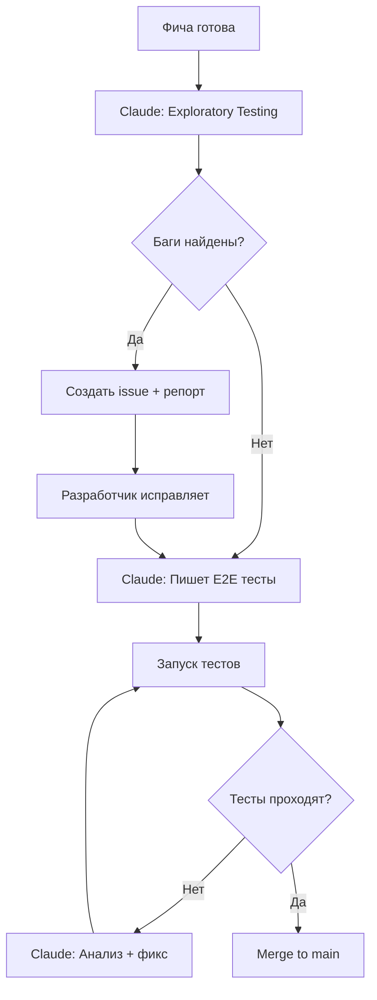

# 🤖 Стратегия тестирования с Claude Code

Комбинированный подход: Playwright E2E + Claude exploratory testing + анализ результатов

---

## 📊 Текущее состояние

### ✅ Что уже есть
- **24 E2E теста** на Playwright (auth, blocks, sync, offline, hotkeys, etc.)
- **Setup проект** с shared storageState для быстрой авторизации
- **Smoke тесты** для критичных проверок
- **Unit тесты** на Jest (`src/js/__tests__/`)
- **Fixtures** для auth, multiuser, websocket, offline
- **CI integration** с parallel workers

### ❌ Что отсутствует
- **Тесты onboarding** (новая фича не покрыта)
- **Visual regression** тесты
- **Performance** тесты
- **Accessibility** тесты
- **Cross-browser** testing (есть config, но не все запускаются)

---

## 🎯 Стратегия использования Claude Code

### 1️⃣ EXPLORATORY TESTING (Исследовательское тестирование)

**Когда использовать:**
- Тестирование новых фич перед написанием автотестов
- Проверка edge cases
- Поиск неочевидных багов
- Тестирование UX/UI flow

**Как это работало в нашем случае:**
```
1. Я зарегистрировался на http://omnimap.cloud.ru/
2. Прошел onboarding flow
3. Нашел 2 критичных бага:
   - Блоки не отображаются после регистрации
   - Ошибка при создании блока на заполненной grid
4. Создал детальный репорт с воспроизведением
```

**Преимущества:**
- 🔍 Нахожу баги, которые не покрыты тестами
- 🧠 Анализирую console logs и network requests в реальном времени
- 📊 Понимаю контекст и пишу детальные репорты
- ⚡ Быстрее, чем писать тест для каждого сценария

**Рекомендуемый workflow:**
```
1. Разработчик добавил новую фичу
2. Claude делает exploratory testing (15-30 мин)
3. Claude находит баги и edge cases
4. Claude пишет репорт + предлагает тест-кейсы
5. Разработчик исправляет баги
6. Claude или разработчик пишет Playwright тесты
```

---

### 2️⃣ WRITING E2E TESTS (Написание автотестов)

**Когда использовать:**
- После exploratory testing
- Для регрессионного покрытия
- Для критичных user flows

**Пример: Напишем тест для onboarding**

```typescript
// e2e/tests/onboarding.spec.ts
import { test, expect } from '@playwright/test';

test.describe('Onboarding @onboarding', () => {
  test.use({ storageState: { cookies: [], origins: [] } }); // Без авторизации

  test('должен показать блоки домашней страницы после регистрации', async ({ page }) => {
    // Регистрация
    await page.goto('/');
    await page.fill('[name="username"]', `test_user_${Date.now()}`);
    await page.fill('[name="email"]', `test${Date.now()}@example.com`);
    await page.fill('[name="password"]', 'TestPassword123!');
    await page.fill('[name="password2"]', 'TestPassword123!');
    await page.click('button[type="submit"]:has-text("Зарегистрироваться")');

    // Ждём приветственное окно
    await expect(page.locator('text=Добро пожаловать в OmniMap!')).toBeVisible();

    // Нажимаем "Начать обзор"
    await page.click('button:has-text("Начать обзор")');

    // БАГ: блоки не отображаются
    // ОЖИДАЕТСЯ: блоки домашней страницы должны быть видны
    await expect(page.locator('[block][data-block-id]')).toHaveCount(6, { timeout: 5000 });

    // Проверяем основные блоки
    await expect(page.locator('text=Inbox')).toBeVisible();
    await expect(page.locator('text=Focus')).toBeVisible();
    await expect(page.locator('text=Projects')).toBeVisible();
    await expect(page.locator('text=Spaces')).toBeVisible();
    await expect(page.locator('text=Areas')).toBeVisible();
    await expect(page.locator('text=Archive')).toBeVisible();
  });

  test('не должен показывать ошибку при создании блока на home page', async ({ page }) => {
    // Авторизация + переход на home page
    // ...

    // Создаём блок
    await page.keyboard.press('n');
    await page.fill('input[placeholder*="название"]', 'Тестовый блок');
    await page.click('button:has-text("OK")');

    // БАГ: показывает "Нет свободного места в сетке"
    // ОЖИДАЕТСЯ: блок создан или grid автоматически расширен
    await expect(page.locator('text=Нет свободного места')).not.toBeVisible();
    await expect(page.locator('text=Тестовый блок')).toBeVisible();
  });
});
```

**Workflow для написания тестов:**
1. Попросите: "Напиши Playwright тест для [описание фичи]"
2. Я напишу тест на основе существующей структуры
3. Вы запускаете: `npm run test:e2e:headed e2e/tests/onboarding.spec.ts`
4. Исправляем если нужно

---

### 3️⃣ RUNNING & ANALYZING TESTS (Запуск и анализ)

**Когда использовать:**
- Перед коммитом
- В CI/CD pipeline
- После исправления багов
- Для проверки регрессий

**Я могу:**
```bash
# Запустить все тесты
npm run test:e2e

# Запустить smoke тесты (быстро)
npm run test:e2e:smoke

# Запустить конкретный тест с UI
npm run test:e2e:ui e2e/tests/onboarding.spec.ts

# Запустить только новые тесты
npx playwright test --grep "@onboarding"
```

**Анализ результатов:**
- Читаю trace файлы и скриншоты
- Анализирую причины падений
- Предлагаю фиксы
- Обновляю тесты если API/UI изменился

---

### 4️⃣ DEBUGGING FAILED TESTS (Отладка упавших тестов)

**Workflow:**
```
1. Тест упал в CI
2. Вы даёте мне trace файл или скриншот
3. Я анализирую причину:
   - Timeout? -> Увеличить expect.timeout или добавить waitFor
   - Element not found? -> Селектор изменился
   - Flaky test? -> Добавить стабилизацию (waitForLoadState, etc.)
4. Я предлагаю фикс
```

**Пример:**
```
Пользователь: "Тест SM-03 упал с timeout на rootContainer"

Claude анализирует:
1. Читает e2e/tests/smoke/smoke.spec.ts
2. Видит: await expect(rootContainer).toBeVisible({ timeout: 10000 })
3. Проверяет логи: медленная загрузка из-за WebSocket reconnect
4. Предлагает: добавить waitForLoadState('domcontentloaded') перед проверкой
```

---

### 5️⃣ VISUAL & ACCESSIBILITY TESTING

**Visual Regression (через Playwright):**
```typescript
test('home page должна выглядеть корректно', async ({ page }) => {
  await page.goto('/');
  await expect(page).toHaveScreenshot('home-page.png', {
    maxDiffPixels: 100,
    fullPage: true
  });
});
```

**Accessibility (через axe-core):**
```typescript
import { injectAxe, checkA11y } from 'axe-playwright';

test('home page должна быть доступна', async ({ page }) => {
  await page.goto('/');
  await injectAxe(page);
  await checkA11y(page);
});
```

**Я могу:**
- Написать эти тесты
- Проанализировать результаты
- Предложить исправления для a11y проблем

---

## 🔄 Рекомендуемый процесс

### При добавлении новой фичи:



### При исправлении бага:

```
1. Баг найден → Claude пишет failing тест
2. Разработчик исправляет → тест зеленеет
3. Тест остаётся как regression coverage
```

### В CI/CD:

```yaml
# .github/workflows/e2e.yml
- name: Run E2E tests
  run: npm run test:e2e

- name: Upload test results
  if: always()
  uses: actions/upload-artifact@v3
  with:
    name: playwright-report
    path: e2e/playwright-report/

# Claude может анализировать результаты через GitHub Actions artifacts
```

---

## 🎪 Продвинутые сценарии

### 1. Multi-user тестирование
У вас уже есть `sync-multiuser.spec.ts`. Я могу:
- Запустить 2 браузера параллельно
- Протестировать real-time sync
- Проверить race conditions

### 2. Performance тестирование
```typescript
test('должен загружаться быстро', async ({ page }) => {
  const startTime = Date.now();
  await page.goto('/');
  await expect(page.locator('#rootContainer')).toBeVisible();
  const loadTime = Date.now() - startTime;

  expect(loadTime).toBeLessThan(3000); // 3 секунды
});
```

### 3. Offline тестирование
У вас есть `offline.spec.ts`. Я могу расширить:
```typescript
test('должен работать offline и синхронизироваться при восстановлении', async ({ page, context }) => {
  // Создаём блок online
  await page.keyboard.press('n');
  await page.fill('input', 'Online блок');
  await page.click('button:has-text("OK")');

  // Переходим offline
  await context.setOffline(true);

  // Создаём блок offline
  await page.keyboard.press('n');
  await page.fill('input', 'Offline блок');
  await page.click('button:has-text("OK")');

  // Проверяем индикатор offline queue
  await expect(page.locator('text=изменений ждут синхронизации')).toBeVisible();

  // Восстанавливаем соединение
  await context.setOffline(false);

  // Ждём синхронизации
  await expect(page.locator('text=изменений ждут синхронизации')).not.toBeVisible({ timeout: 10000 });
});
```

---

## 📝 Checklist использования Claude для тестирования

### Перед коммитом:
- [ ] Claude сделал exploratory testing новой фичи
- [ ] Написаны E2E тесты для критичных путей
- [ ] Локально прогнаны smoke тесты: `npm run test:e2e:smoke`
- [ ] Проверены console errors в браузере

### После коммита в CI:
- [ ] Все E2E тесты проходят
- [ ] Если тесты упали → Claude анализирует причину
- [ ] Visual regression тесты прошли (если есть)
- [ ] Coverage не снизился

### При баге в продакшн:
- [ ] Claude воспроизводит баг в dev
- [ ] Пишется failing тест
- [ ] Баг исправляется
- [ ] Тест зеленеет и остаётся как защита

---

## 🚀 Быстрый старт

### Попросите меня:

**"Claude, протестируй фичу X"**
→ Я делаю exploratory testing + пишу репорт

**"Claude, напиши тест для Y"**
→ Я пишу Playwright тест в стиле вашего проекта

**"Claude, почему упал тест Z?"**
→ Я анализирую trace/скриншот и предлагаю фикс

**"Claude, запусти smoke тесты"**
→ Я запускаю `npm run test:e2e:smoke` и анализирую результаты

**"Claude, добавь visual regression для home page"**
→ Я пишу тест с screenshot assertions

---

## 💡 Лучшие практики

### ✅ DO:
- Используйте меня для exploratory testing новых фич
- Просите написать тесты для найденных багов
- Показывайте мне упавшие тесты для анализа
- Используйте для проверки edge cases
- Просите обновлять тесты при изменении API

### ❌ DON'T:
- Не заменяйте все тесты на мануальное тестирование
- Не пропускайте написание тестов после находки бага
- Не запускайте тесты вручную перед каждым коммитом (CI должен)
- Не пишите тесты без предварительного exploratory testing

---

## 📚 Полезные команды

```bash
# Exploratory testing через браузер
# (Попросите меня открыть браузер и протестировать)

# Запустить все E2E тесты
npm run test:e2e

# Smoke тесты (быстро)
npm run test:e2e:smoke

# Интерактивный режим (выбор тестов)
npm run test:e2e:ui

# Конкретный файл
npx playwright test e2e/tests/onboarding.spec.ts

# С отображением браузера
npm run test:e2e:headed

# Только тесты с тегом
npx playwright test --grep "@smoke"

# Debug конкретного теста
npx playwright test e2e/tests/onboarding.spec.ts --debug

# Показать отчет
npx playwright show-report e2e/playwright-report
```

---

## 🎯 Следующие шаги

1. **Написать тесты для onboarding** (сейчас не покрыто)
2. **Добавить visual regression** для критичных страниц
3. **Расширить offline тестирование**
4. **Добавить performance метрики**
5. **Настроить accessibility проверки**

---

**TL;DR:**
Используйте меня для:
1. 🔍 Exploratory testing новых фич
2. ✍️ Написания Playwright тестов
3. 🐛 Анализа упавших тестов
4. 📊 Расширения покрытия (visual, a11y, performance)

Playwright остаётся для:
- Регрессионного покрытия
- CI/CD автоматизации
- Smoke тестов
- Критичных user flows
